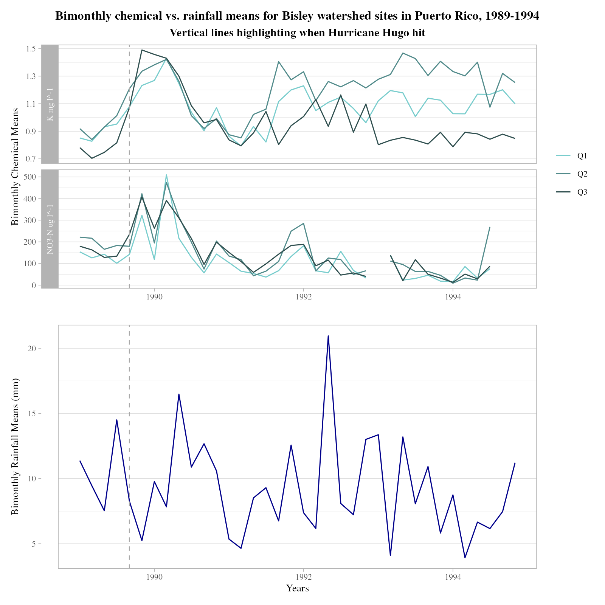

<!-- Add banner here -->

# Rainfall and Stream Chemistry Impacts of Hurricane Hugo

Here we plot stream chemistry and rainfall in the Luquillo Long Term Ecological Research site before and after Hurricane Hugo struck Puerto Rico in 1989. This project was created as an assignment for EDS 214 at UC Santa Barbara taught by Dr. Julien Brun.

## Installation

You can visit, fork, and clone our repository at [`https://github.com/javipatron/equipo-nimbus`](https://github.com/javipatron/equipo-nimbus)

To use this project, download the following data from [Chemistry of stream water from the Luquillo Mountains](https://portal.edirepository.org/nis/mapbrowse?packageid=knb-lter-luq.20.4923058)

-   [Quebrada one-Bisley (Q1) Chemistry Data](https://portal.edirepository.org/nis/dataviewer?packageid=knb-lter-luq.20.4923058&entityid=96e0ef7b3f2bc92485a559645d545845)

-   [Quebrada two-Bisley (Q2) Chemistry Data](https://portal.edirepository.org/nis/dataviewer?packageid=knb-lter-luq.20.4923058&entityid=8d1e2d357a2dc2d56b9eedea56a46236)

-   [Quebrada three-Bisley (Q3) Chemistry Data](https://portal.edirepository.org/nis/dataviewer?packageid=knb-lter-luq.20.4923058&entityid=665f37efee3109a7c3aff95e079e2de2)

-   [Puente Roto Mameyes (MPR) Chemistry Data](https://portal.edirepository.org/nis/dataviewer?packageid=knb-lter-luq.20.4923058&entityid=acb18d969cf36e7efda2604a1449e816)

Also download the following data from Bisley rainfall and throughfall, and chemistry of rainfall and throughfall [`https://portal.edirepository.org/nis/mapbrowse?packageid=knb-lter-luq.148.1213961`](https://portal.edirepository.org/nis/mapbrowse?packageid=knb-lter-luq.148.1213961)

-   [Bisley Rain and Throughfall weekly measurements](https://portal.edirepository.org/nis/dataviewer?packageid=knb-lter-luq.148.1213961&entityid=321e187b737007eece552ab269b5e626)

## About the data

Stream chemistry data were collected weekly within the [Luquillo Long Term Ecological Research](https://lternet.edu/site/luquillo-lter/) site and made available by McDowell, William H.

Rainfall data were collected weekly within the [Luquillo Long Term Ecological Research](https://lternet.edu/site/luquillo-lter/) site and made available by Heartsill-Scalley, Tamara.

## Contribute

This project is not actively being maintained outside of the course EDS 214 at UCSB. However, for bugs spotted in this code, please submit an issue to the [GitHub repository](https://github.com/javipatron/equipo-nimbus).

## References

**Publication:**

Schaefer, D., McDowell, W., Scatena, F., & Asbury, C. (2000). Effects of hurricane disturbance on stream water concentrations and fluxes in eight tropical forest watersheds of the Luquillo Experimental Forest, Puerto Rico. Journal of Tropical Ecology, 16(2), 189-207. [**doi:10.1017/S0266467400001358**](doi:10.1017/S0266467400001358)

**Data References:**

Chemistry of stream water from the Luquillo Mountains

-   McDowell, W. 2022. Chemistry of stream water from the Luquillo Mountains ver 4923058. Environmental Data Initiative. <https://doi.org/10.6073/pasta/1dd1a59a7e6fbe95fdf8736477d81b83> (Accessed 2022-08-25).

Bisley rainfall and throughfall, and chemistry of rainfall and throughfall

-   Heartsill-Scalley, T. 2017. Bisley rainfall and throughfall, and chemistry of rainfall and throughfall ver 1213961. Environmental Data Initiative. <https://doi.org/10.6073/pasta/fe51799a303a8504c0562426fbc850c6> (Accessed 2022-08-25).
